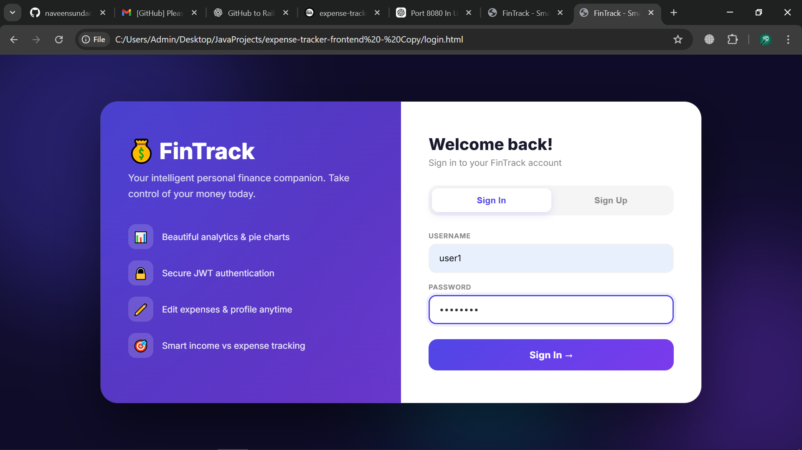
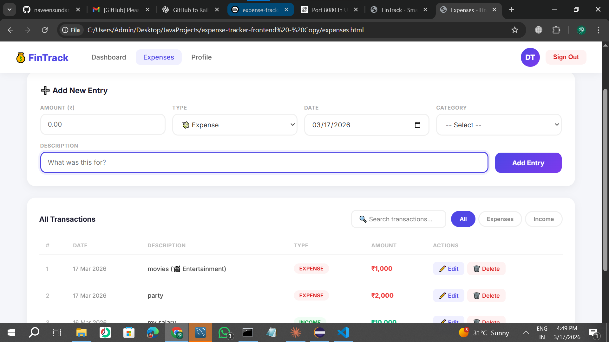
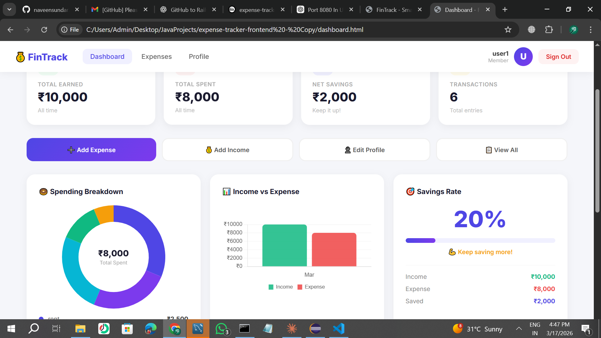
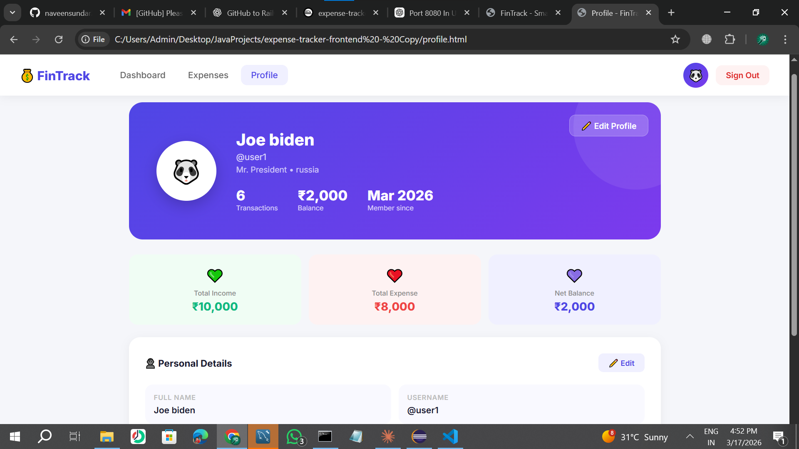
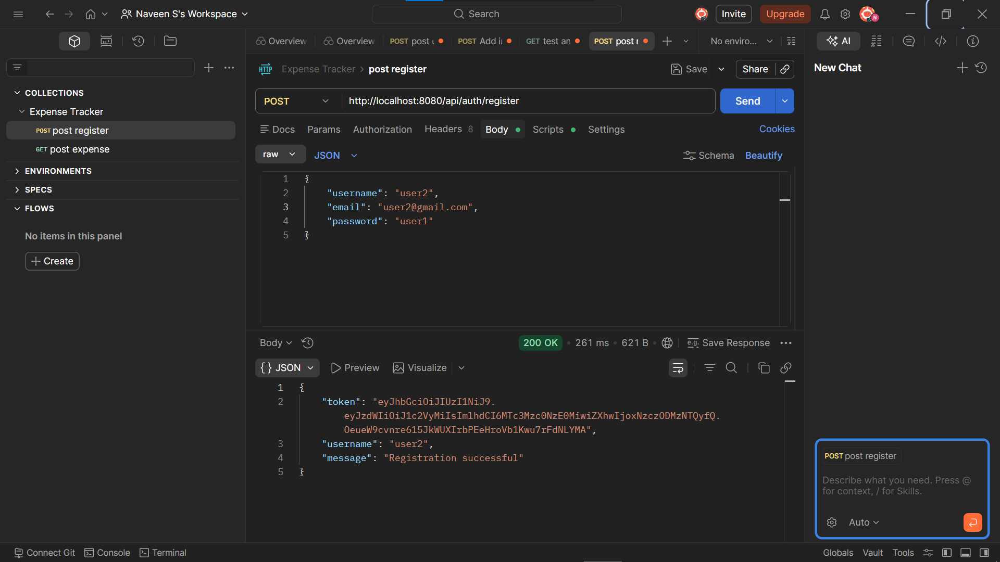
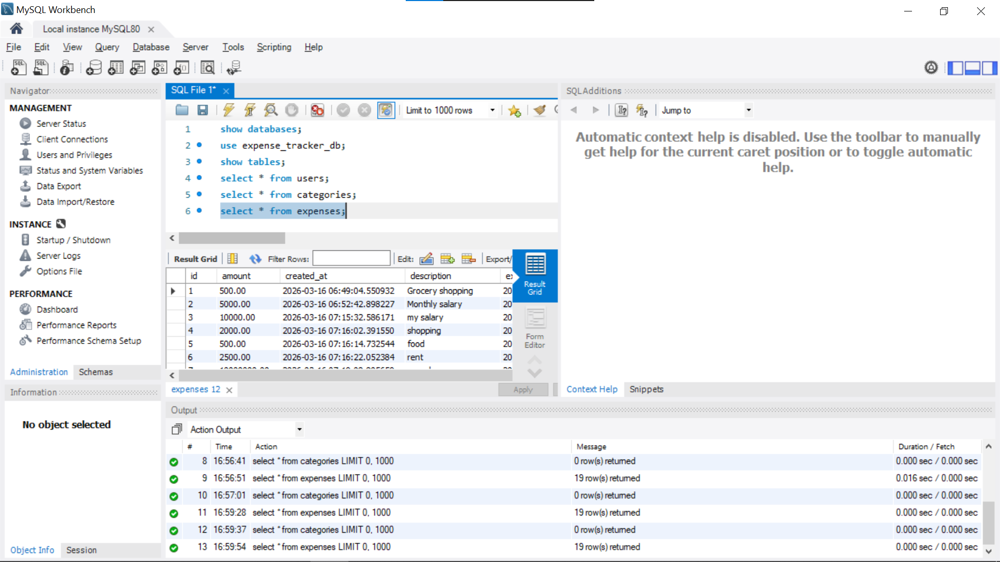

# 💰 FinTrack - Smart Expense Tracker

**FinTrack** is an intelligent personal finance companion that helps you track income, expenses, and visualize your financial data with beautiful charts.  

---

## 📝 Project Description

This project is a full-stack web application built with:  

- **Backend:** Java Spring Boot, Spring Data JPA, MySQL  
- **Frontend:** HTML, CSS, JavaScript  
- **Authentication:** JWT  
- **Features:**  
  - User registration & login  
  - Add, edit, delete expenses  
  - Income vs expense tracking  
  - Analytics & pie charts  
  - Profile management

---

## 📁 Folder Structure


expense-tracker/
├─ src/ # Backend Java code
├─ frontend/ # Frontend HTML, CSS, JS
├─ screenshots/ # Screenshots of the app
├─ pom.xml # Maven project file
└─ README.md


---

## 💻 Screenshots

**Login Page**  


**Expense Page**  


**Dashboard / Analytics**  


**Profile Page**  


**Testing Backend**  


**Viewing Database**  


---

## ⚡ How to Run

1. Clone the repo:  
```bash
git clone https://github.com/naveensundar2005/expense-tracker.git

Go to backend folder and run:

cd expense-tracker
mvn spring-boot:run

Open frontend/index.html in your browser.

📌 Future Improvements

Add expense categories and subcategories

Make the frontend fully responsive for mobile and tablet devices

Implement a dark mode toggle

Integrate real-time bank APIs for automatic expense tracking

Add monthly reports and charts for better visualization

Implement password recovery / forgot password functionality

Add multi-currency support for international users

👤 Author

Naveen Sundar
GitHub : https://github.com/naveensundar2005
Email: naveenpanimalar2022@gmail.com